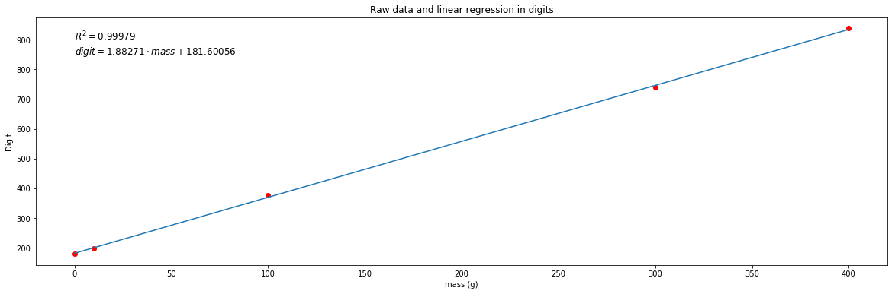
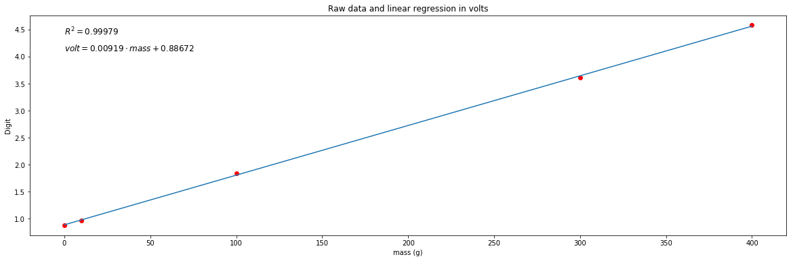
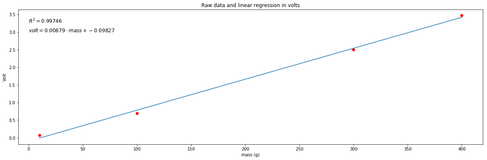
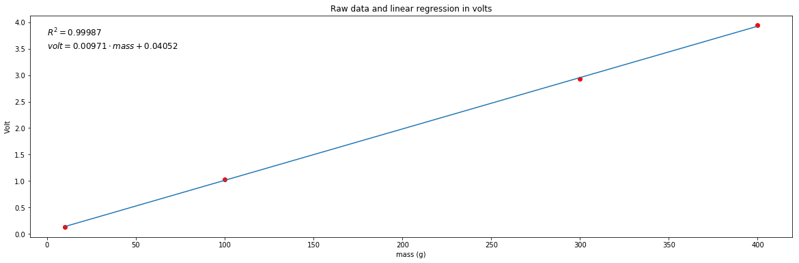
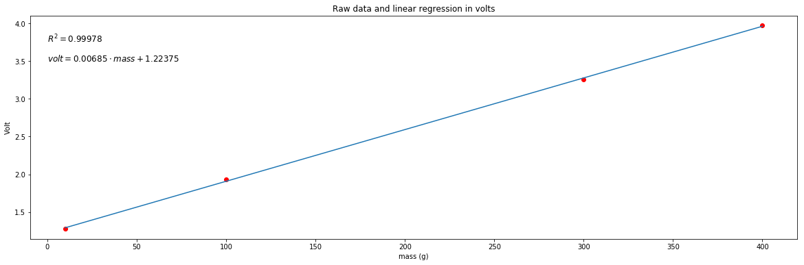

# Strain gauges calibration

```python
%matplotlib inline
import matplotlib.pyplot as plt
plt.rcParams["figure.figsize"] = (20,6)
import numpy as np
from scipy import stats

# Raw data : masses (g) and digits (between 0 and 1023)
l1 = 0; d1 = 180;    # No mass, 180 is an offset
l2 = 10; d2 = 199;   # Mass is 10g
l3 = 100; d3 = 376;  # Mass is 100g
l4 = 300; d4 = 740;  # Mass is 30g
l5 = 400; d5 = 938;  # Mass is 400g
masses = np.array([l1, l2, l3, l4, l5])
digits = np.array([d1, d2, d3, d4, d5])

# Linear regression and plots with digits
slope, intercept, r_value, p_value, std_err = stats.linregress(masses,digits)
plt.plot(masses, digits, 'or', masses, slope*masses + intercept)
plt.text(0, 900, '$R^2 = ' + ('%.5f' % r_value**2) + "$", fontsize=12)
plt.text(0, 850, '$digit = ' + ('%.5f' % slope) + "\cdot mass + " + ('%.5f' % intercept) + "$", fontsize=12)
plt.title('Raw data and linear regression in digits')
plt.xlabel('mass (g)')
plt.ylabel('Digit');
```





```python
# Convert digit to volt : 0 -> 0V, 1023 -> (5 - 5/2^10)V
volts = digits/1023*(5 - 5/2**10) 
# It's not mandatory to redo linear regression. 
# One could directly apply this transformation (digit to volt) to previous linear regression equation.
# It's not the choice i have done here...
slope, intercept, r_value, p_value, std_err = stats.linregress(masses, volts)

# Linear regression and plots with volts
plt.plot(masses, volts, 'or', masses, slope*masses + intercept)
plt.text(0, 4.4, '$R^2 = ' + ('%.5f' % r_value**2) + "$", fontsize=12)
plt.text(0, 4.1, '$volt = ' + ('%.5f' % slope) + "\cdot mass + " + ('%.5f' % intercept) + "$", fontsize=12)
plt.title('Raw data and linear regression in volts')
plt.xlabel('mass (g)')
plt.ylabel('Volt');
```





# Four other gauges, amplified using INA125AP with 6.0Vcc


```python
%matplotlib inline
import matplotlib.pyplot as plt
plt.rcParams["figure.figsize"] = (20,6)
import numpy as np
from scipy import stats

# Raw data : masses (g) and volts (between 0 and 5V)
l1 = 10; v1 = 0.07;   # Mass is 10g
l2 = 100; v2 = 0.69;  # Mass is 100g
l3 = 300; v3 = 2.5;  # Mass is 30g
l4 = 400; v4 = 3.47;  # Mass is 400g
masses = np.array([l1, l2, l3, l4])
volts = np.array([v1, v2, v3, v4])

# Linear regression and plots with volts
slope, intercept, r_value, p_value, std_err = stats.linregress(masses,volts)
plt.plot(masses, volts, 'or', masses, slope*masses + intercept)
plt.text(0, 3.25, '$R^2 = ' + ('%.5f' % r_value**2) + "$", fontsize=12)
plt.text(0, 3., '$volt = ' + ('%.5f' % slope) + "\cdot mass + " + ('%.5f' % intercept) + "$", fontsize=12)
plt.title('Raw data and linear regression in volts')
plt.xlabel('mass (g)')
plt.ylabel('Volt');
```





```python
# Raw data : masses (g) and volts (between 0 and 5v)
l1 = 10; v1 = 0.13;   # Mass is 10g
l2 = 100; v2 = 1.03;  # Mass is 100g
l3 = 300; v3 = 2.93;  # Mass is 30g
l4 = 400; v4 = 3.94;  # Mass is 400g
masses = np.array([l1, l2, l3, l4])
volts = np.array([v1, v2, v3, v4])

# Linear regression and plots with digits
slope, intercept, r_value, p_value, std_err = stats.linregress(masses,volts)
plt.plot(masses, volts, 'or', masses, slope*masses + intercept)
plt.text(0, 3.75, '$R^2 = ' + ('%.5f' % r_value**2) + "$", fontsize=12)
plt.text(0, 3.5, '$volt = ' + ('%.5f' % slope) + "\cdot mass + " + ('%.5f' % intercept) + "$", fontsize=12)
plt.title('Raw data and linear regression in volts')
plt.xlabel('mass (g)')
plt.ylabel('Volt');
```





```python
# Raw data : masses (g) and volts (between 0 and 5V)
l1 = 10; v1 = 1.28;   # Mass is 10g
l2 = 100; v2 = 1.93;  # Mass is 100g
l3 = 300; v3 = 3.26;  # Mass is 30g
l4 = 400; v4 = 3.97;  # Mass is 400g
masses = np.array([l1, l2, l3, l5])
volts = np.array([v1, v2, v3, v4])

# Linear regression and plots with digits
slope, intercept, r_value, p_value, std_err = stats.linregress(masses,volts)
plt.plot(masses, volts, 'or', masses, slope*masses + intercept)
plt.text(0, 3.75, '$R^2 = ' + ('%.5f' % r_value**2) + "$", fontsize=12)
plt.text(0, 3.5, '$volt = ' + ('%.5f' % slope) + "\cdot mass + " + ('%.5f' % intercept) + "$", fontsize=12)
plt.title('Raw data and linear regression in volts')
plt.xlabel('mass (g)')
plt.ylabel('Volt');
```





```python
# Raw data : masses (g) and volts (between 0 and 5V)
l1 = 10; v1 = 0.22;   # Mass is 10g
l2 = 100; v2 = 1.25;  # Mass is 100g
l3 = 300; v3 = 3.36;  # Mass is 30g
l4 = 400; v4 = 4.5;  # Mass is 400g
masses = np.array([l1, l2, l3, l4])
volts = np.array([v1, v2, v3, v4])

# Linear regression and plots with digits
slope, intercept, r_value, p_value, std_err = stats.linregress(masses,volts)
plt.plot(masses, volts, 'or', masses, slope*masses + intercept)
plt.text(0, 4.25, '$R^2 = ' + ('%.5f' % r_value**2) + "$", fontsize=12)
plt.text(0, 4, '$digit = ' + ('%.5f' % slope) + "\cdot mass + " + ('%.5f' % intercept) + "$", fontsize=12)
plt.title('Raw data and linear regression in volts')
plt.xlabel('mass (g)')
plt.ylabel('Volt');
```


